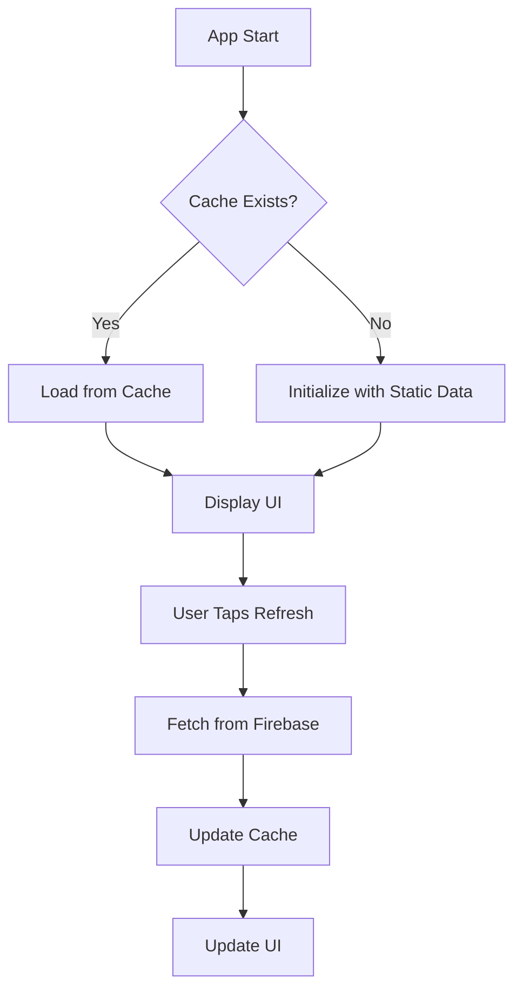

# 📱 Offline-First Price Monitoring Guide

## 🎯 Overview

The AgriAssist app now uses an **offline-first approach** for price monitoring, providing fast loading times and reliable data access even without internet connection.

## 🚀 Key Features

### ✅ **Fast Loading**
- Data loads instantly from local cache
- No waiting for Firebase connections
- Smooth user experience

### ✅ **Manual Refresh Control**
- Users control when to update prices
- Refresh button in header for manual updates
- Clear feedback on refresh status

### ✅ **Offline Capability**
- Works without internet connection
- Uses cached data when offline
- Graceful fallback to cached data

### ✅ **Smart Caching**
- 24-hour cache duration
- Automatic cache validation
- Efficient storage management

## 🔄 How It Works

### 1. **Initial Load**
```
App Start → Check Cache → Load Cached Data → Display UI
```

### 2. **Manual Refresh**
```
User Taps Refresh → Fetch from Firebase → Update Cache → Update UI
```

### 3. **Offline Mode**
```
No Internet → Use Cached Data → Show Last Known Prices
```

## 📊 Data Flow



## 🛠️ Implementation Details

### **Offline Service** (`services/offlineCommodityService.ts`)
- Manages local cache storage
- Handles Firebase synchronization
- Provides cache validation

### **React Hooks** (`hooks/useOfflineCommodities.ts`)
- `useCommoditiesWithRefresh()` - Main hook with refresh capability
- `useDataRefresh()` - Manual refresh functionality
- `useCacheInfo()` - Cache status information

### **Cache Initializer** (`components/OfflineCacheInitializer.tsx`)
- Initializes cache on first app launch
- Converts static data to cache format
- One-time setup process

## 🎮 User Experience

### **Price Monitoring Screen**
- **Header**: Refresh button (🔄) for manual updates
- **Loading**: Shows cached data immediately
- **Refresh**: Button changes to hourglass (⏳) during update
- **Feedback**: Success/error alerts after refresh

### **Admin Screen**
- **Same offline-first approach**
- **Manual refresh for price updates**
- **Real-time updates when connected**

## 📱 Cache Management

### **Storage Keys**
- `cached_commodities` - All commodity data
- `cached_prices` - Latest price information
- `cached_categories` - Category definitions
- `last_data_update` - Last refresh timestamp

### **Cache Structure**
```typescript
{
  data: T[],
  timestamp: number,
  version: string
}
```

### **Cache Validation**
- 24-hour expiration
- Automatic cleanup
- Version tracking

## 🔧 Configuration

### **Cache Duration**
```typescript
const CACHE_DURATION = 24 * 60 * 60 * 1000; // 24 hours
```

### **Refresh Behavior**
- Manual refresh only
- No automatic background updates
- User-controlled data freshness

## 🚨 Error Handling

### **Network Errors**
- Falls back to cached data
- Shows error message
- Allows retry

### **Cache Errors**
- Initializes with static data
- Logs errors for debugging
- Continues app operation

## 📈 Benefits

### **Performance**
- ⚡ **Instant loading** from cache
- 🚀 **No network delays**
- 💾 **Efficient storage**

### **Reliability**
- 📱 **Works offline**
- 🔄 **Manual control**
- 🛡️ **Graceful fallbacks**

### **User Experience**
- 🎯 **Predictable loading**
- 🔄 **Clear refresh control**
- 📊 **Always shows data**

## 🔮 Future Enhancements

### **Planned Features**
- Background sync when connected
- Push notifications for price updates
- Cache size management
- Selective refresh by category

### **Advanced Options**
- Custom cache duration
- Offline analytics
- Data compression
- Incremental updates

## 🛠️ Development

### **Adding New Data**
1. Update static data in `constants/CommodityData.ts`
2. Clear cache: `AsyncStorage.clear()`
3. Restart app to reinitialize

### **Testing Offline Mode**
1. Turn off internet connection
2. Open app
3. Verify cached data loads
4. Test refresh button (should show error)

### **Cache Debugging**
```typescript
import { OfflineCommodityService } from '../services/offlineCommodityService';

// Check cache info
const info = await OfflineCommodityService.getCacheInfo();
console.log('Cache info:', info);

// Clear cache
await OfflineCommodityService.clearCache();
```

## 📞 Support

For issues or questions about the offline-first implementation:
- Check console logs for cache operations
- Verify AsyncStorage permissions
- Test with different network conditions
- Review Firebase connection status

---

**🎉 The app now provides a much faster and more reliable price monitoring experience!**

