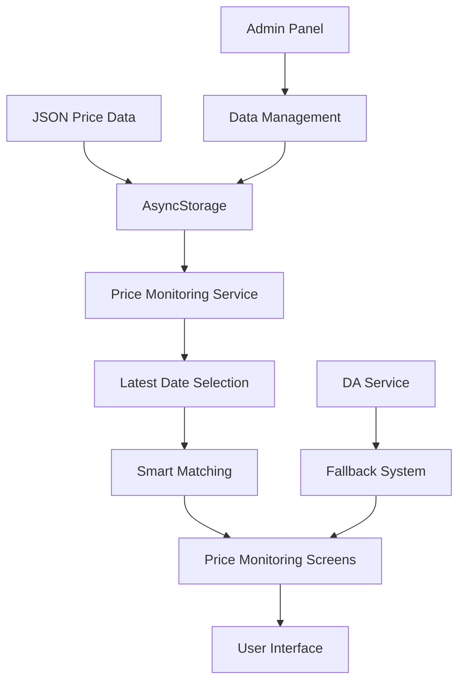

# Price Monitoring Update Guide

## Overview

The price monitoring system has been updated to use the latest data from your stored JSON price data. The system now prioritizes stored data over external DA service data, ensuring that the most recent prices from your dataset are displayed.

## ✅ What's Been Updated

### 1. **Enhanced Storage Utils** (`lib/storageUtils.ts`)
- **`getLatestPriceData()`**: Gets the most recent price for each commodity/type combination
- **`getPriceDataByDateRange()`**: Filters price data by date range
- **`getPriceDataByCommodity()`**: Gets all price data for a specific commodity
- **`getPriceTrends()`**: Gets price trends over time for analysis

### 2. **New Price Monitoring Service** (`lib/priceMonitoringService.ts`)
- **Smart Data Matching**: Matches stored data with commodity definitions
- **Trend Analysis**: Calculates price changes and percentages
- **Fallback System**: Falls back to DA service if no stored data available
- **Statistics**: Provides comprehensive price monitoring statistics

### 3. **Updated Price Monitoring Screens**
- **Price Monitoring Screen** (`app/price-monitoring.tsx`)
- **Home Screen** (`app/(tabs)/index.tsx`)
- Both screens now prioritize stored data over external sources

### 4. **Admin Panel Integration** (`app/admin.tsx`)
- **Update Price Monitoring** button to apply latest data
- **Price statistics** display
- **Real-time monitoring** of data updates

## 🚀 How It Works

### Data Priority System
1. **First Priority**: Latest data from AsyncStorage
2. **Second Priority**: DA service data (fallback)
3. **Automatic Updates**: When stored data is available, it's used immediately

### Latest Date Selection
The system automatically selects the most recent date for each commodity/type combination:

```typescript
// Example: For "KADIWA RICE-FOR-ALL" with multiple dates
// System will select the latest date: 2025-10-01T00:00:00
{
  "Commodity": "KADIWA RICE-FOR-ALL",
  "Type": "Premium (RFA5)",
  "Amount": 43.0,
  "Date": "2025-10-01T00:00:00"  // ← Latest date selected
}
```

### Smart Matching
The system matches stored data with commodity definitions using:
- **Exact name matching**
- **Category-based matching**
- **Keyword matching** for different languages (e.g., "rice" → "bigas", "kadiwa")

## 📊 Features

### 1. **Latest Price Display**
- Shows the most recent price for each commodity
- Displays the date when the price was recorded
- Shows price source (stored data vs DA service)

### 2. **Price Trends**
- Calculates price changes from previous periods
- Shows percentage changes
- Provides trend indicators (up/down/stable)

### 3. **Comprehensive Statistics**
- Total commodities with prices
- Average price changes
- Last update timestamp
- Data source information

### 4. **Admin Controls**
- **Store Price Data**: Upload new JSON data
- **View Price Data**: Check what's stored
- **Update Price Monitoring**: Apply latest data to monitoring
- **Storage Info**: View storage statistics

## 🔧 Usage Instructions

### For Administrators

1. **Store New Price Data**
   ```
   Admin Panel → Store Price Data → Confirm
   ```

2. **Update Price Monitoring**
   ```
   Admin Panel → Update Price Monitoring → Confirm
   ```

3. **View Statistics**
   ```
   Admin Panel → Update Price Monitoring → View Results
   ```

### For Users

1. **View Current Prices**
   ```
   Price Monitoring Screen → Automatic display of latest prices
   ```

2. **Check Price Trends**
   ```
   Price Monitoring Screen → View commodity cards with trend indicators
   ```

3. **Refresh Data**
   ```
   Pull down to refresh → Gets latest stored data
   ```

## 📈 Data Flow



## 🎯 Key Benefits

### 1. **Accurate Pricing**
- Uses your specific price data
- Always shows the most recent prices
- Eliminates dependency on external services

### 2. **Better Performance**
- Faster loading (local data)
- No network dependencies
- Consistent data availability

### 3. **Enhanced Analytics**
- Price trend analysis
- Historical data comparison
- Comprehensive statistics

### 4. **User Experience**
- Seamless data updates
- Clear price indicators
- Reliable information display

## 🔍 Technical Details

### Data Processing
```typescript
// Latest price selection algorithm
const latestPrices = {};
storedData.forEach(item => {
  const key = `${item.Commodity}-${item.Type}-${item.Specification}`;
  const itemDate = new Date(item.Date);
  
  if (!latestPrices[key] || itemDate > new Date(latestPrices[key].Date)) {
    latestPrices[key] = item;
  }
});
```

### Smart Matching
```typescript
// Category-based matching
const categoryKeywords = {
  'rice': ['rice', 'bigas', 'kadiwa'],
  'corn': ['corn', 'mais'],
  'vegetables': ['vegetables', 'gulay']
};
```

### Trend Calculation
```typescript
// Price change calculation
const change = currentPrice - previousPrice;
const changePercentage = (change / previousPrice) * 100;
```

## 🚨 Important Notes

### Data Requirements
- **Date Format**: ISO 8601 format (YYYY-MM-DDTHH:mm:ss)
- **Price Format**: Numeric values (e.g., 43.0)
- **Commodity Names**: Should match or be similar to defined commodities

### Fallback Behavior
- If no stored data: Falls back to DA service
- If DA service fails: Shows default commodity data
- If no data at all: Shows "No price data available"

### Performance Considerations
- Data is cached in memory for fast access
- Latest date selection is done once per session
- Trend calculations are done on-demand

## 🔄 Maintenance

### Regular Updates
1. **Upload new JSON data** when available
2. **Update price monitoring** to apply changes
3. **Monitor statistics** for data quality
4. **Clear old data** if needed

### Troubleshooting
- **No prices showing**: Check if data is stored in AsyncStorage
- **Wrong prices**: Verify commodity name matching
- **Old dates**: Ensure latest data is uploaded
- **Performance issues**: Clear AsyncStorage and re-upload data

## 📞 Support

For issues or questions:
1. Check the **Storage Info** in Admin Panel
2. Verify data is properly stored
3. Check console logs for error messages
4. Use the **Update Price Monitoring** function to refresh

---

## 🎉 Summary

Your price monitoring system now uses the latest data from your stored JSON dataset! The system automatically selects the most recent prices for each commodity and displays them in the price monitoring screens. Users will see accurate, up-to-date pricing information based on your specific data, with fallback to external services when needed.

The admin panel provides full control over data management, and the system is designed to be fast, reliable, and user-friendly.


